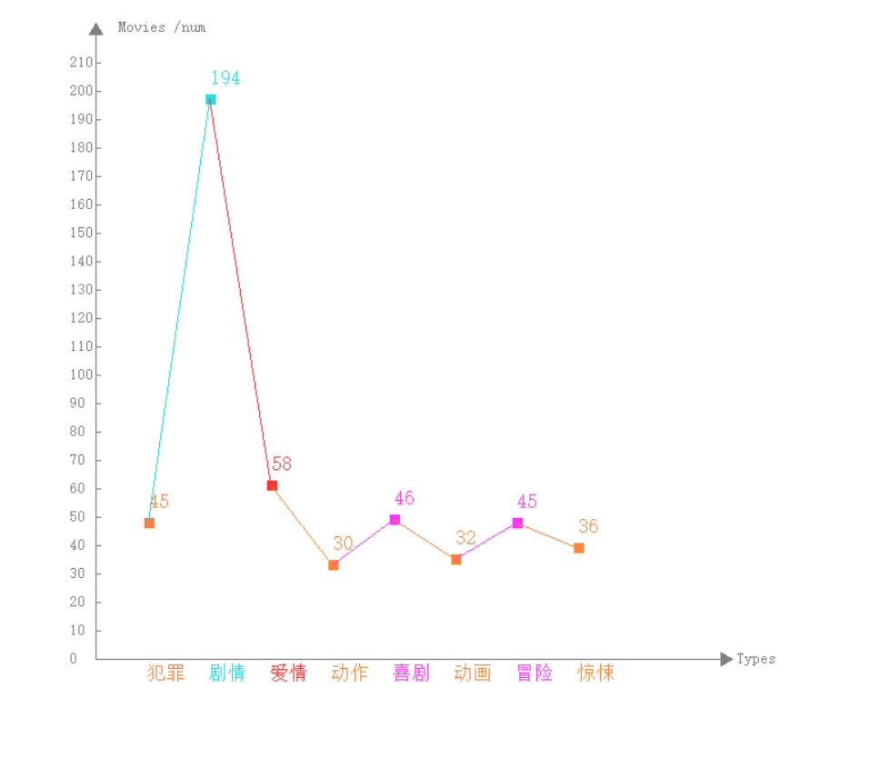
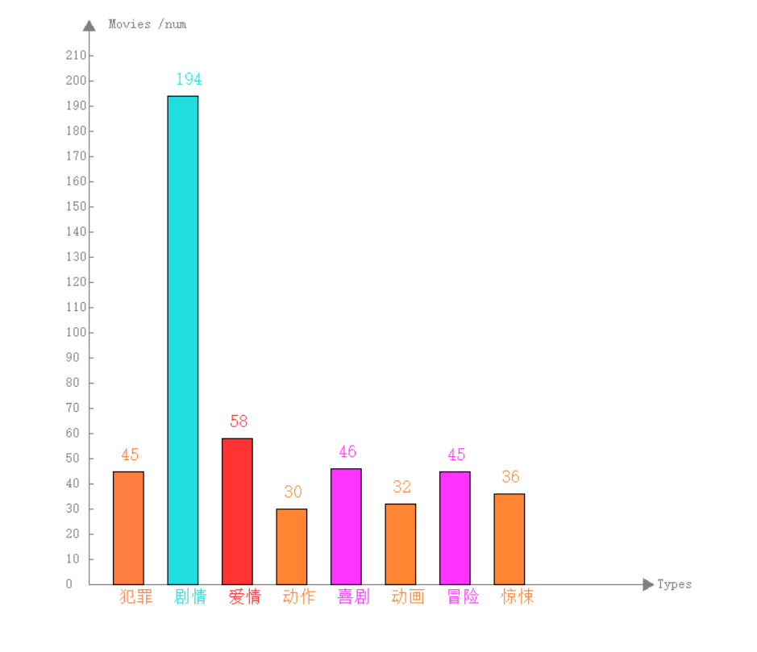
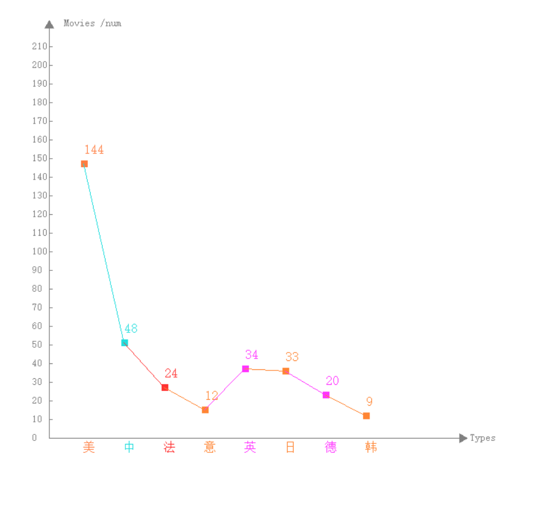
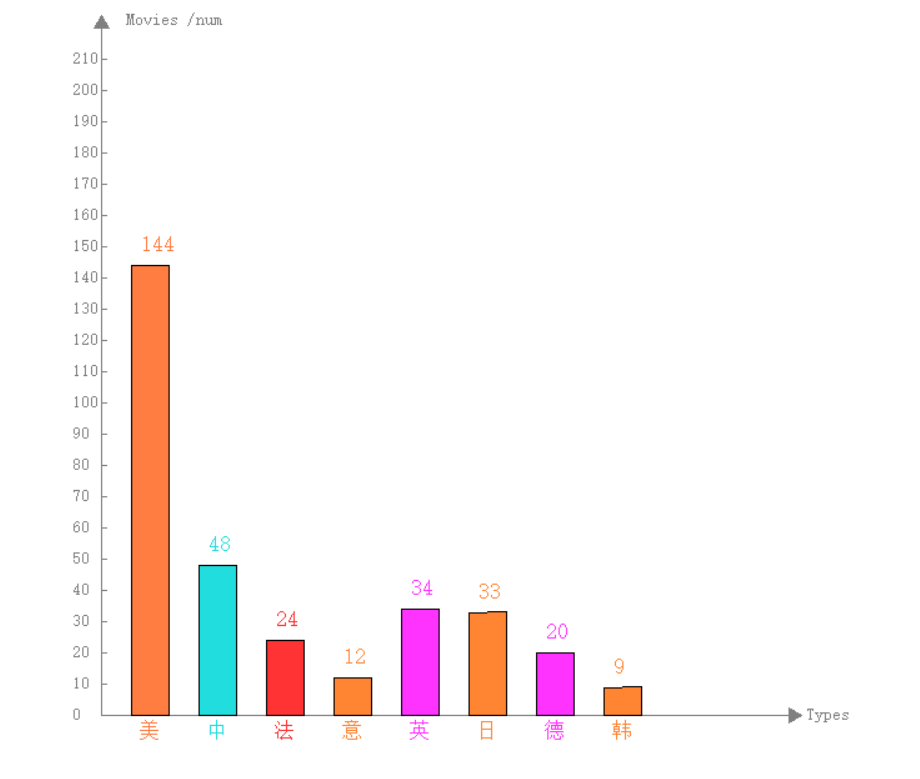

# crawler python
> 爬取豆瓣 ***TOP250*** 及 数据可视化

 
- 1.豆瓣电影 ***top250***:

    - ***type***
    
    

    - ***country***
    
    

    - ***cover***
    

 

### 2.MVC 模式
- model
    - 后端 api python 
    - json 格式保存数据 
    
- control  
    - 数据处理 
    - 文件处理 提取有用的信息
    
- view    
    - 数据可视化
    - 自制画图工具 ***painting*** 
    
### 3.其他

-  那些内容不可以爬 （做一位文明的程序员）/robots.txt